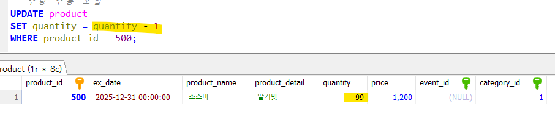
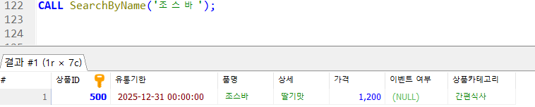

# be13-1st-showMeTheMoney-PosMos

## 프로젝트명: Point Of Sales Management Of Sales

||||||
|:-:|:-:|:-:|:-:|:-:|
|이성일 [@Sirius147](https://github.com/Sirius147)|박서준 [@pppseojun](https://github.com/pppseojun)|오영광 [@OhGlory](https://github.com/OhGlory)|염정운 [@ericyum](https://github.com/ericyum)|권지민 [@Kwonjiin](https://github.com/kwonjiin)|

   

## 프로젝트 개요
POS(Point of Sale)는 판매 시점 관리 시스템을 의미합니다. 주로 소매업, 특히 편의점, 슈퍼마켓, 레스토랑 등에서 사용되며, 고객과의 거래가 이루어지는 시점에서 상품의 판매와 관련된 여러 작업을 처리하는 시스템입니다. 

POS 사용 전에는 주로 금전 등록기를 사용했습니다. 많은 업무가 수작업으로 진행되어 효율성이 낮고 오류 발생 가능성이 높으며, 고객 서비스의 품질 또한 제한적이었습니다. 편의점 POS 시스템은 단순히 결제 수단을 제공하는 것을 넘어, 매장 운영, 고객 서비스, 데이터 기반 경영을 최적화하는 중요한 도구입니다. 
   
## 프로젝트 목적

### 실시간 재고 관리

실시간으로 재고 상태를 추적하고, 물품 매입 또는 판매가 이루어질 때마다 자동으로 재고를 업데이트 합니다.

### 정확한 매출 분석

POS 시스템에서 발생한 거래 데이터를 기반으로 매출 분석을 자동적으로 진행하여 운영자는  더욱 정확한 예산 계획을 통해 원활한 운영에 도움을 줍니다.

### 고객 맞춤형 서비스

고객의 구매 패턴을 분석하여 자주 구매하는 제품을 추천하거나 자주 구매하는 상품의  할인 정보를 알려줌으로써 매장에 대한 고객 만족도를 높일 수 있습니다.
   
## 프로젝트 배경

최근 넷플릭스에서 방영된 흑백요리사 가 큰 인기를 끌며, 해당 프로그램과 협업한 편의점 간편식 및 디저트 제품들이 대중의 폭발적인 관심을 받았습니다. 이로 인해 특정 제품이 빠르게 품절되는 **‘편의점 대란’** 현상이 발생하였고, 많은 사람들이 편의점을 자주 찾는 계기가 되었습니다.
최근 미디어 콘텐츠와 편의점 산업의 융합으로 인해 변화하는 소비 트렌드에 대응하며, 소상공인들에게 실질적인 도움을 주는 디지털 도구를 개발하는 데 초점을 맞추고 있습니다.

미디어 콘텐츠와 결합된 상품이 소비자들의 구매 패턴에 미치는 영향력이 증가하면서, **편의점 내 물품의 재고 관리와 현황 파악의 중요성**이 더욱 부각되고 있음을 느꼈습니다
   

## 기술스택

## 주요기능소개

* **판매 관리를 통한 바코드 스캔과 다양한 결제 처리로 빠르고 정확한 판매 지원**
* **결제 및 재고 관리 관련된 일련의 프로세스를 지원**
* **매출 데이터와 판매 트렌드를 분석해 운영 최적화**
* **고객 관리 및 상품 이벤트 등록을 통해 프로모션을 진행**
* **직원관리를 통해 효율적인 매장관리에 기여**
   
## WBS(Work Breakdown Structure)
[WBS](https://docs.google.com/spreadsheets/d/1djYNOycBP0-a5PDg302wS7SK1A8XTu9u7n0CP0yBa0A/edit?usp=sharing)

   
## 요구사항명세서
[요구사항명세서](https://docs.google.com/spreadsheets/d/1djYNOycBP0-a5PDg302wS7SK1A8XTu9u7n0CP0yBa0A/edit?usp=sharing)

   
## ERD(Entity Relationship Diagram)

   
## 테이블명세서
→ [테이블 명세서 바로가기](https://docs.google.com/spreadsheets/d/1Qbms6sxZx3EFGe-pK14aio6_7FWvGO805NjnDVXdgvA/edit?usp=sharing)

   
## 테스트 케이스
→ [테스트 케이스 바로가기](https://docs.google.com/spreadsheets/d/1djYNOycBP0-a5PDg302wS7SK1A8XTu9u7n0CP0yBa0A/edit?usp=sharing)

  

    
판매 거래 관련 기능

        

        
1. 판매할 판매 기록 추가

            
        

        

            
2. 영수증 생성

            
        

        

            
3. 새로 생성된 영수증 ID저장

            
        

        

            
4. 판매테이블에 영수증ID 반영

            
        

        

            
5. 총 금액 계산

            
          
        

        

            
6. 최근 영수증에 기입된 회원ID와 적용될 포인트 저장

            
        

        

            
7. 회원 포인트 적립

            
        

        

            
8. 회원이 포인트 사용시

            
        

        

            
9. 최종 영수증

            
        

    

    

    
환불처리 관련 기능

        

1.환불 정보 등록

            
        

            

2.마지막 삽입된 환불의 상품ID를 저장

            
        

            

3.환불시 재고 증가

            
        

            

4.영수증 환불반영

            
        

            

5.환불 완료 영수증

            
        

    

    

    
상품 재고 관련 기능

        

1.상품 입고(재고 수량 추가)

            
            
        

        

2.상품 판매(재고 수량 감소)

            
        

        

3.불량재고량 수정

            
        

        

4.신상품 등록

            
        

        

5.상품ID 검색

            
        

            

6.상품명 검색

        
        

        

7.키워드 검색

            
        

    

    

   
직원 관리 관련 기능

        

1.직원 등록

            
        

        

2.직원 삭제

            
        

        

3.근무자 로그인

            
            
            
        

        

4.출근시간 기록

            
        

        

5.근무자 로그아웃

            
            
            
        

        

6.퇴근시간 기록

            
        

        

7.근무 확인

            
            
            
        

    

    

    
프로모션 및 할인

        

1.쿠폰

            
  

            
  

            
  

        

        

2.타임할인

            
  

            
  

            
  

        

        

3.1+1행사

            
  

            
  

            
  

            
  

        
    
    

     

    
고객 관리

        

1.고객등록

            
            
        

        

2.고객 구매 내역 확인

            
        

    

  

    
보고서 및 분석

        

1.일별 보고서

            
        

        

2.월별 보고

            
        

       

3. 시간별 보고서

            
        

        

4. 카테고리별 보고서

            
        

             

5. 손실상품  보고서

            
        

    

   

## 회고록

| 조원 이름 | 회고 |
| --------- | --- |
| 이성일 | 아이디어 설계의 구체화 과정의 중요성을 깨달았다. | 
| 권지민 | 복잡한 시스템 설계를 체계적으로 접근하는 방법을 배우고, 모델링 과정의 중요성을 깨닫는 계기가 되었습니다. | 
| 박서준 | POS기의 결제 프로세스를 이해하고 ERD설계와 데이터 구성, 참조 관계 설정 등  프로젝트의 초기 구축 단계의 중요성을 깨달았다. | 
| 염정운 | 편의점 POS의 시스템을 MariaDB를 통해 구현하면서  테이블과 테이블 사이를 어떻게 잇는지와 쿼리문을 짜고 실행하는 기초를 다질 수 있었다. | 
| 오영광 | POS 시스템의 전반적인 프로세스를 이해하고  팀원들과 협업하는 과정에서 소통의 중요성을 느꼈다.  데이터 모델링을 하면서 나온 문제를 디버깅하며 뜻깊은 시간이었고,  너무 잘해준 우리 팀원들 앞으로도 화이팅! |
 

